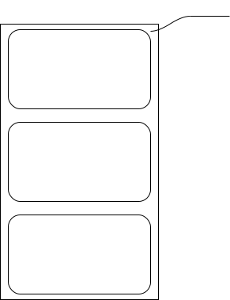
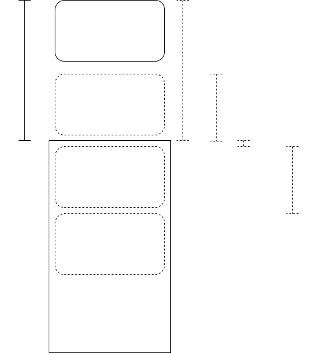
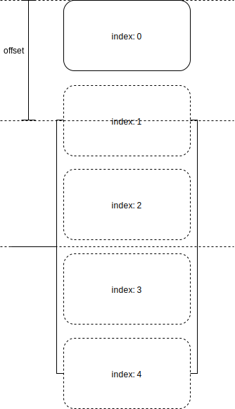

# DataPicker的Picker开发原理


###### Picker作为DataPicker中的一列。它的质量，决定了DataPicker的质量。也是最复杂的一部分。


为什么说他复杂：

1. 需要用户手离开时自动定位最靠近中间位置的元素，并选中。
2. 当用户拉到列表边缘，继续上拉/下拉时，要有粘性效果阻止用户上拉/下拉。让用户感知到已经到达列表边缘。
3. 当用户快速滚动列表时，列表要能根据用户手指离开时的速度惯性向下滑动一段距离，并自动定位到某一个元素。
4. 滚动过程中，需要根据选项距中心的距离，设置字体大小，字体颜色。

为什么不能使用原生overflow实现：

1. 元素的scrollTop属性兼容性不够理想
2. -webkit-scrollbar伪属性兼容性不理想
3. 元素scroll，经过惯性滚动后，可能会定位到两个元素的中间某点，需要在滚动结束后再自动定位到临近元素上。而优秀的picker会根据用户松手时的初速度和阻力，自动滑动到最接近的元素上，而不会出现滑到两个元素中间任意某处。
4. 原生scroll拉到列表底部继续拉，手机屏幕长一些可以把列表最后一项拉到消失，我们可以优化这一点。

这里会详细介绍Picker组件的核心 - 这个竖列我们之后称之为picker。其他功能、布局以及实现原理比较简单，有兴趣可以直接参照代码，这里不在赘述。


## 基本结构

实际上，我们是在模拟一个原生列表的实现。我们的模块结构基本上与列表无异。



完整的实现列表功能难度是非常大的。但是picker允许我们将一些地方简化，比如固定item高度！

为什么要固定item高度呢？这对能简化多少实现？答案是：必须固定、非常多。

1. 我们要实现自动定位的功能，肯定需要知道每个元素距离的scrollTop。而如果我们自己实现列表，scrollTop就需要累加所有之前的item元素的高度。
2. 如果Item高度不固定，那么Item的高度受到内部的内容、行高、字体大小等属性影响，每个item高度计算将会非常复杂，还容易出错，还需要根据新的css规范进行不断更新。这工作量相当大。
3. 进行元素居中，列表惯性滚动并定位到目标元素时由于每个item高度不一致，会导致算法实现变得复杂。进而可能会影响计算速度。
4. 如果item高度不一致，会导致List高度无法确定。无论如何处理，总可能出现遮盖部分item的现象，严重影响视觉效果。

因此，我们将item高度固定为itemHeight，List高度为itemHeight * visibleNumber。
在此基础上，我们对picker的几个核心功能逐一介绍。


## 模拟滚动

为了方便实现。我们将所有item设置为`position: absolute`来进行绝对定位。通过设置item的top属性，来排布item。

我们将List列表顶部距离列表哪第一个元素的距离成为offset。这样说这几个属性比较抽象。看图：



在图片中，为了能够区分item，item与List之间，item与item直接是有边距的，实际开发中，是没有这个边距的。所以`index: 2`的`top`为0。

按照没有边距的情况计算，得到：`top = - (offset - index * itemHeight)`。
我们可以得出进一步的结论：“只需要知道`offset`的值，就可以计算出每一个元素的`top`”。

初始状态下第一个item（`index: 0`)应当位于列表中央。得：initOffset = minOffset = -itemHeight。

为实现滚动，移动端我们需要监听`touchStart`, `touchMove`, `touchEnd`三个事件：

* touchStart：记录用户手指初始位置`touchStartY`和列表初始位置`touchStartOffset`。
* touchMove：获取用户手指位置`touchMoveY`，
  用户移动距离`touchMoveOffset = touchStartY - touchMoveY`。
  此时`offset = touchStartOffset + touchMoveOffset * sensitivity`。
* touchEnd：清空`touchStartY`，`touchStartOffset`等信息。

##### 注：sensitivity属性用于控制手指滑动的灵敏度。sensitivity = 1时，用户滑动距离等于列表滚动距离，不过一般都是大于1，因为1:1的速度会让用户感觉操作困难。推荐值2。


## 自动定位

在说具体实现前，我们需要先确认offset的有效范围（设`itemNumber`代表item的总数量）

- `minOffset`（最小值）：出现在选择第一个的时候：`-itemHeight`。
- `maxOffset`（最大值）：出现在选择最后一个的时候：`(itemNumber - 2) * itemHeight`。

为验证上面的值正确，可以计算只有一个选项时：`minOffset === maxOffset`。


然后我们推到一下item的index与offset范围的关系：

- offset的有效范围是：`[-itemHeight, (itemNumber - 2) * itemHeight]`。
- 提取公共项目我们可以发现有效范围等价于 [-1, itemNumber - 2]
- 两边都+1后得到[0, itemNumber - 1]。而这个恰好是list的数组index范围。

我们不难推倒出一层映射关系 `offset / itemHeight + 1 === index`。同时我们得到offset与index成正比。


然后我们开始讲自动定位：

当用户松开手时(暂不考虑惯性滚动），将选项中心距离列表中心最近的选项剧中。(为了简化，我们选择匀速动画)

此时我们已知数据有：

- 用户松手时的offset
- item的高度itemHeight


推到过程：

- 最开始我们得到映射关系：`offset / itemHeight + 1 === index`。
  这里我们可以得到：`indexA = offset / itemHeight + 1`。
- `indexA`四舍五入可以得到最接近的整数`indexB = Math.round(indexA)`。
  `indexB`就是距离中心最近的item的index。
- 不过由于`四舍五入`，党中心距离前后两个item距离相同的时候，`五入`导致了会自动选择下一个item。
  但是：由于Picker往往展示在手机下方，用户视角会导致用户看`上一个item`距离中心更近。
  因此，我们需要`五舍，大于五入`。可以通过`offset - 1`来实现这个效果。

  

最终我们得到最接近中心的`indexC`为`Math.round((offset - 1) / itemHeight + 1)`。

还需要考虑一种特殊情况，目前用户是可以将列表无限向下拉的，这回导致offset可能小于最小值。

所以我们需要再加一层最大最小值的限制：`indexD = Math.min(itemNumber - 2, Math.max(indexC, -1))`

`indexD`即为距离中心最近的item的index。
我们可以进一步计算得出，使`itemD`剧中的offset值为`(indexD - 1) * itemHeight`。

然后我们只需要一个动画将当前的`offset`变更为`(indexD - 1) * itemHeight`


## 上拉/下拉粘性效果实现

之前虽然拉超出范围可以自动定位回去了，但是匀速回弹显然不够。因为用户拉出边界后无阻力，跟正常滑动列表一样，这体验并不好。

要实现粘性效果乍一想很难，不过实际分析一下其实也不是那么难。


并且我们能确定几个事实：

* offset的有效范围：`[-itemHeight, (itemNumber -2) * itemHeight]`。
* ios上拉/下拉超过边界后，∆offset = sensitivity * ∆touchMoveOffset / 2。经过多次测试后得出近似结论。
* 存在逗比用户，上拉到边界后继续使劲上拉。

为了方便讨论，需要将offset分成两种

* realOffset：根据用户下拉计算的实际的offset值。
* visibleOffset：增加粘性效果后，用户看到的List的offset值。

`realOffset`就是未增加粘性效果，在`模拟滚动`一节实际算出来的offset。
`touchStartOffset`的取值便是当时的`realOffset`。

当用户滑动时我们可以得到：realOffset = touchStartOffset + touchMoveOffset * sensitivity。

visibleOffset理论上应当是realOffset的一个映射。按照IOS效果，这个映射函数图像应当是：


我们可以看到`realOffset => visibleOffset`是的映射是一个三段函数。

我们只需要在`touchMove`、`scrollTo`等任何函数设置offset时，增加一步，将`realOffset`转化为`visibleOffset`，即可得到粘性效果。


得到标准的粘性效果之后，我们再来处理那些逗比用户。我们需要将我们的三段映射函数改变的近似于：


我们可以将超过区间的映射函数从线性改成一个具有极限的，增长速度逐渐变缓，最终不断接近一个极值的函数fn。

看到这个曲线是不是很熟悉？这个线其实就是log函数的一部分 --- 函数斜率为(0, 1/2)的这一段。

看一下如何实现这个函数，首先我们需要一个js函数获得以x为底y的对数：

```js
const getBaseLog = (x, y) => Math.log(y) / Math.log(x);
```

由于底数决定了整个曲线的走势，所以我们可以称这个底数为x = coefficient（阻力系数）

推理过程：

- 通过google，我们不难求的，以x为底的log函数，y点的积分为`1/(ylnx)`。我们应该知道，函数的积分代表这个函数曲线的斜率。
- 那么我们可以得到log函数斜率为1/2的点为：`z = 2 / ln(x)`。同理得，斜率为0的点为正无穷。
- 将log的函数图像左移`z`，下移`getBaseLog(x, z)`，得：`getBaseLog(x, (y + z)) - getBaseLog(x, z)`
- 因此，我们可以得到对于大于maxOffset的部分：
  * `∆realOffset = sensitivity * ∆touchMoveOffset`
  * `∆visibleOffset = getBaseLog(x, ∆realOffset + z) - getBaseLog(x, z)`
- 同理，我们可以求出小于minOffset的部分
- 将这两部分与中间正比部分组合，得到三段函数，即为映射函数。


这样，无论用户手机多长，粘性效果都会将最后一项黏在显示范围内，用户会有*越拉阻力越大*的感觉（设置一个合理的coefficient）。
而对于正常用户，在短距离超出范围时，体验效果接近于原生，因为这个函数输入x在起始范围时，观察图像，其实是约等于ios映射函数。


## 惯性滚动

惯性滚动，就是用户滑动松手时，列表进行匀减速直线运动，直到停止时静止到某一个元素上。

首先，我们要确定用户松手时候的速度：

- 在`touchStart`, `touchMove`两个事件中记录当前的`touchY`以及`time`为`lastTouchTime`、`lastTouchY`。
- 在记录之前，如果lastTouchTime、与lastTouchY存在值，记录`speed = (touchY - lastTouchY) / (touchTime - lastTouchTime)`。
- 阻力、速度都是有方向的，设定一个变量`direction = speed / Math.abs(speed)`。代表`touchY`的惯性滚动方向。
- 为避免速度过快设定一个`maxSpeed`, `speed = Math.min(Math.abs(speed), maxSpeed) * direction`。


这样我们就可以在touchEnd时得到用户松手时候的速度`speed`。
另外，我们需要为列表设定一个阻力`drag`。确定减速度。不如假设摩擦系数为1，减速度`accelerated = drag`

设惯性滚动过的距离为`∆touchMoveY`，滚动到停止使用的总时间时间为`maxT`，当前时间点为`t`时，推导出：

* `maxT = speed / (2 * accelerated) * direction`
* `∆t = Math.min(t - lastTouchTime, maxT)`
* `∆touchMoveY = speed * ∆t - accelerated * ∆t * ∆t * direction`

当接收到touchEnd时，我们可以通过`requestAnimationFrame`不断获取当前时间`t`，并计算此时的`∆touchMoveY`。

我们可以认为此时`touchMoveY = lastTouchY + ∆touchMoveY * direction`。

根据第一节模拟滚动的结论通过`touchMoveY`，`touchStartY`，以及`touchStartOffset`我们可以计算出`offset`。这样就做出来惯性滚动效果了。

我们在`touchEnd`事件中等惯性滚动结束了（即`∆t === maxT`），再去清空`touchStartY`和`touchStartOffset`等数据。

这还需要继续优化，因为这样实现的惯性滚动和原生效果一样。用户滑动后会滚动到两个选项中的某一个点，而不是直接滚动到某个选项！

虽然可以在`touchEnd`惯性滚动结束后追加一个自动定位。但是这样体验一点都不好。我们需要直接滚动到最相近的目标选项！

根据上面的计算公式，初速度，加速度都确定的情况下，不可能改变最终结果。因此我们有两个方案：

- 提前计算`maxT`时的`offset`，并通过此时的`offset`算得最接近的元素的`index`，进而得到最接近的`offset`。然后倒推出来近似初速度。
- 同上，不过是倒推出来近似的加速度。

如果倒推出来初速度并进行惯性滚动，那么用户每次抬手可能会感觉到手感不太对。而改动加速度，用户抬手速度不会变，而因为自动定位造成的偏移非常小。分摊到每秒（实际为1/60s)的加速度也就更少。因此加速度的修正对用户感知影响更小。


方案确定了，之后要综合之前所有推到结论逐步计算：

- ∆offset = speed * speed / (2 * accelerated)
- direction = speed / Math.abs(speed)
- touchMoveY = lastTouchY + ∆offset * direction
- touchMoveOffset = touchStartY - touchMoveY
- offset = touchStartOffset + touchMoveOffset * sensitivity（模拟滚动章节推导结论）
- indexA = Math.round((offset - 1) / itemHeight + 1)（自动定位章节推导结论）
- indexB = Math.min(Math.max(indexA, -1), itemNumber - 2)（自动定位章节推导结论）
- expectOffset = (indexB - 1) * itemHeight（自动定位章节推导结论）
- realAccelerated = 2 * expectOffset / (speed * speed)

然后我们使用`speed`, `realAccelerated`通过`requestAnimationFrame`来计算每个时间点的`realOffset`。就完成了我们的惯性滚动。
